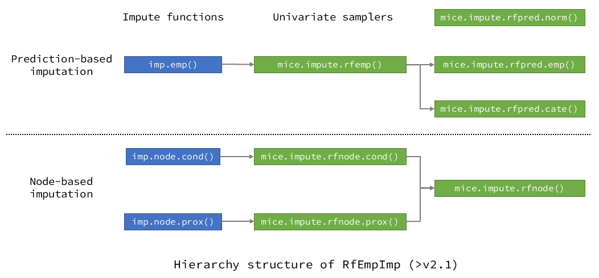

<!-- README.md is generated from README.Rmd. Please edit that file -->

# RfEmpImp <a href='https://github.com/shangzhi-hong/RfEmpImp'></a>

[](https://CRAN.R-project.org/package=RfEmpImp)
[](https://github.com/shangzhi-hong/RfEmpImp)
[](https://www.tidyverse.org/lifecycle/#maturing)  
An R package for random-forest-empowered imputation of missing Data

## Random-forest-based multiple imputation evolved

`RfEmpImp` is an R package for multiple imputation using chained random
forests (RF).  
This R package provides prediction-based and node-based multiple
imputation algorithms using random forests, and currently operates under
the multiple imputation computation framework
[`mice`](https://CRAN.R-project.org/package=mice).  
For more details of the implemented imputation algorithms, please refer
to: [arXiv:2004.14823](https://arxiv.org/abs/2004.14823) (further
updates soon).

## Installation

Users can install the CRAN version of `RfEmpImp` from CRAN, or the
latest development version of `RfEmpImp` from GitHub:

``` r
# Install from CRAN
install.packages("RfEmpImp")
# Install from GitHub online
if(!"remotes" %in% installed.packages()) install.packages("remotes")
remotes::install_github("shangzhi-hong/RfEmpImp")
# Install from released source package
install.packages(path_to_source_file, repos = NULL, type = "source")
# Attach
library(RfEmpImp)
```

## Prediction-based imputation

### For mixed types of variables

For data with mixed types of variables, users can call function
`imp.rfemp()` to use `RfEmp` method, for using `RfPred-Emp` method for
continuous variables, and using `RfPred-Cate` method for categorical
variables (of type `logical` or `factor`, etc.).  
Starting with version `2.0.0`, the names of parameters were further
simplified, please refer to the documentation for details.

### Prediction-based imputation for continuous variables

For continuous variables, in `RfPred-Emp` method, the empirical
distribution of random forest’s out-of-bag prediction errors is used
when constructing the conditional distributions of the variable under
imputation, providing conditional distributions with better quality.
Users can set `method = "rfpred.emp"` in function call to `mice` to use
it.

Also, in `RfPred-Norm` method, normality was assumed for RF prediction
errors, as proposed by Shah *et al.*, and users can set
`method = "rfpred.norm"` in function call to `mice` to use it.

### Prediction-based imputation for categorical variables

For categorical variables, in `RfPred.Cate` method, the probability
machine theory is used, and the predictions of missing categories are
based on the predicted probabilities for each missing observation. Users
can set `method = "rfpred.cate"` in function call to `mice` to use it.

### Example for prediction-based imputation

``` r
# Prepare data
df <- conv.factor(nhanes, c("age", "hyp"))
# Do imputation
imp <- imp.rfemp(df)
# Do analyses
regObj <- with(imp, lm(chl ~ bmi + hyp))
# Pool analyzed results
poolObj <- pool(regObj)
# Extract estimates
res <- reg.ests(poolObj)
```

## Node-based imputation

For continuous or categorical variables, the observations under the
predicting nodes of random forest are used as candidates for
imputation.  
Two methods are now available for the `RfNode` algorithm series.  
It should be noted that categorical variables should be of types of
`logical` or `factor`, etc.

### Node-based imputation using predicting nodes

Users can call function `imp.rfnode.cond()` to use `RfNode-Cond` method,
performing imputation using the conditional distribution formed by the
prediction nodes.  
The weight changes of observations caused by the bootstrapping of random
forest are considered, and only the “in-bag” observations are used as
candidates for imputation.  
Also, users can set `method = "rfnode.cond"` in function call to `mice`
to use it.

### Node-based imputation using proximities

Users can call function `imp.rfnode.prox()` to use `RfNode-Prox` method,
performing imputation using the proximity matrices of random forests.  
All the observations fall under the same predicting nodes are used as
candidates for imputation, including the out-of-bag ones.  
Also, users can set `method = "rfnode.prox"` in function call to `mice`
to use it.

### Example for node-based imputation

``` r
# Prepare data
df <- conv.factor(nhanes, c("age", "hyp"))
# Do imputation
imp <- imp.rfnode.cond(df)
# Or: imp <- imp.rfnode.prox(df)
# Do analyses
regObj <- with(imp, lm(chl ~ bmi + hyp))
# Pool analyzed results
poolObj <- pool(regObj)
# Extract estimates
res <- reg.ests(poolObj)
```

## Imputation functions

| Type                        | Impute function | Univariate sampler        | Variable type |
|-----------------------------|-----------------|---------------------------|---------------|
| Prediction-based imputation | imp.emp()       | mice.impute.rfemp()       | Mixed         |
|                             | /               | mice.impute.rfpred.emp()  | Continuous    |
|                             | /               | mice.impute.rfpred.norm() | Continuous    |
|                             | /               | mice.impute.rfpred.cate() | Categorical   |
| Node-based imputation       | imp.node.cond() | mice.impute.rfnode.cond() | Mixed         |
|                             | imp.node.prox() | mice.impute.rfnode.prox() | Mixed         |
|                             | /               | mice.impute.rfnode()      | Mixed         |

## Package structure

The figure below shows how the imputation functions are organized in
this R package.  


## Support for parallel computation

As random forest can be compute-intensive itself, and during multiple
imputation process, random forest models will be built for the variables
containing missing data for a certain number of iterations (usually 5 to
10 times) repeatedly (usually 5 to 20 times, for the number of
imputations performed). Thus, computational efficiency is of crucial
importance for multiple imputation using chained random forests,
especially for large data sets.  
So in `RfEmpImp`, the random forest model building process is
accelerated using parallel computation powered by
[`ranger`](https://CRAN.R-project.org/package=ranger). The ranger R
package provides support for parallel computation using native C++. In
our simulations, parallel computation can provide impressive performance
boost for imputation process (about 4x faster on a quad-core laptop).

## References

1.  Hong, Shangzhi, et al. “Multiple imputation using chained random
    forests.” Preprint, submitted April 30, 2020.
    <https://arxiv.org/abs/2004.14823>.
2.  Zhang, Haozhe, et al. “Random forest prediction intervals.” The
    American Statistician (2019): 1-15.
3.  Wright, Marvin N., and Andreas Ziegler. “ranger: A Fast
    Implementation of Random Forests for High Dimensional Data in C++
    and R.” Journal of Statistical Software 77.i01 (2017).
4.  Shah, Anoop D., et al. “Comparison of random forest and parametric
    imputation models for imputing missing data using MICE: a CALIBER
    study.” American Journal of Epidemiology 179.6 (2014): 764-774.
5.  Doove, Lisa L., Stef Van Buuren, and Elise Dusseldorp. “Recursive
    partitioning for missing data imputation in the presence of
    interaction effects.” Computational Statistics & Data Analysis 72
    (2014): 92-104.
6.  Malley, James D., et al. “Probability machines.” Methods of
    information in medicine 51.01 (2012): 74-81.
7.  Van Buuren, Stef, and Karin Groothuis-Oudshoorn. “mice: Multivariate
    Imputation by Chained Equations in R.” Journal of Statistical
    Software 45.i03 (2011).
